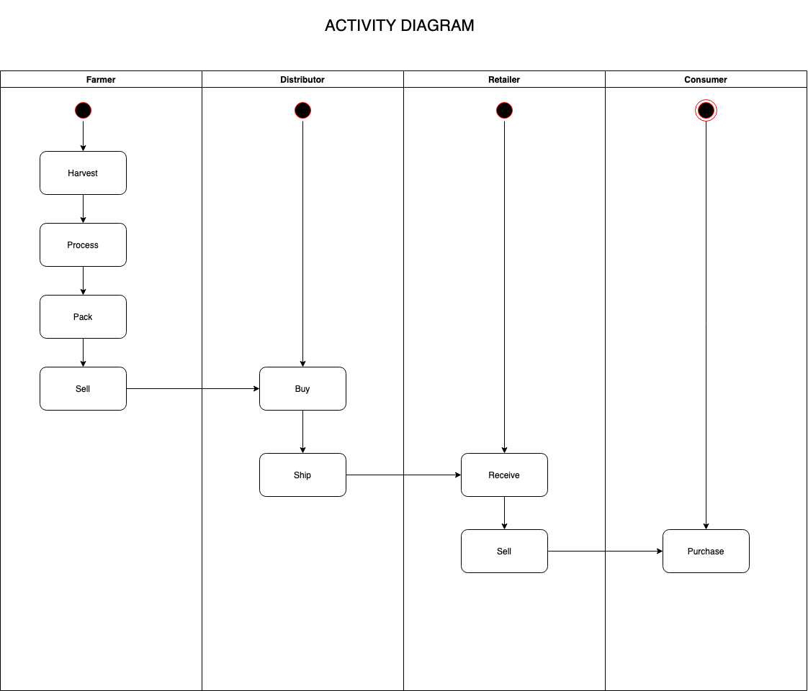
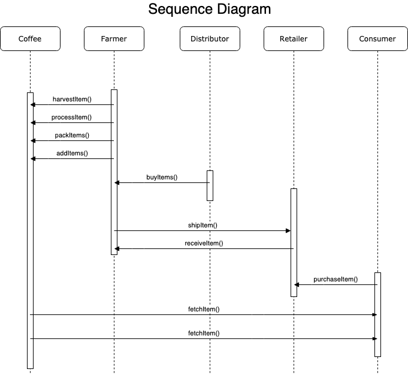
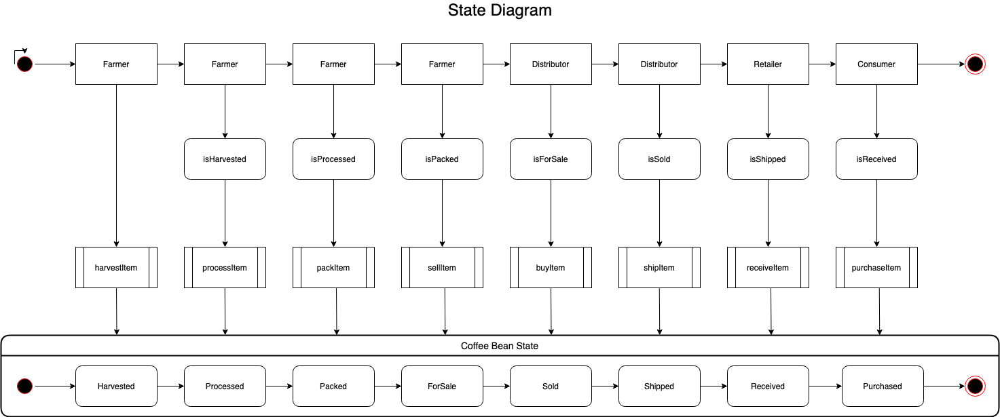

# Supply chain & data auditing

This repository containts an Ethereum DApp that demonstrates a Supply Chain flow between a Seller and Buyer. The user story is similar to any commonly used supply chain process. A Seller can add items to the inventory system stored in the blockchain. A Buyer can purchase such items from the inventory system. Additionally a Seller can mark an item as Shipped, and similarly a Buyer can mark an item as Received.

## Contract Address

```
Farmer Role - 0xc9EC6d6123a2533BBa30Fa919653A3ed6e35961A
Distributor Role - 0xF772da55007EdD8Ca652BdFd59b725dac670EA50
Retailer Role - 0x0f6Ce2Bc8F74599b100308349A3f2B39B54cf622
Consumer Role - 0xD6cA0CB198d07dF4881993AD7591DCa308AF42D0
Supply Chain - 0xb02B307cAFf761d6e72CCe8AD4d69C690289C9dF
```

## Libraries

`truffle-hdwallet-provider` was used in order to sign transactions for addresses derived from a 12-word mnemonic.
To install `truffle-hdwallet-provider`, run the following command:

```

\$ npm install --save truffle-hdwallet-provider

```

### Program version numbers

v1.0

### node version

v12.18.0

### Truffle version

v5.1.13

### web3 version

v1.2.9

```

```

## UML Diagrams

### Activity Diagram



### Sequence Diagram



### State Diagram



### Class Diagram


